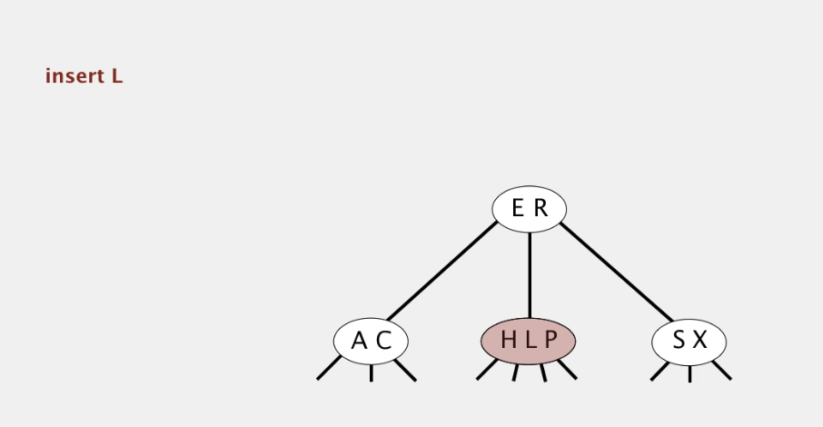
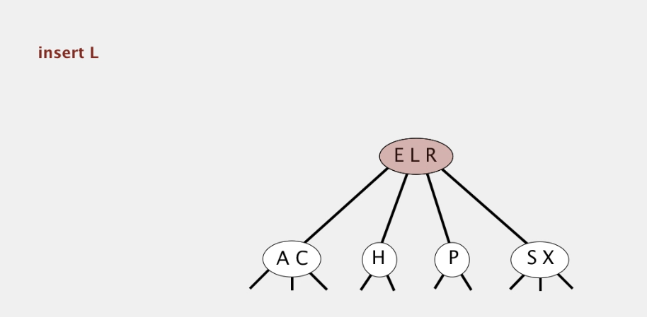
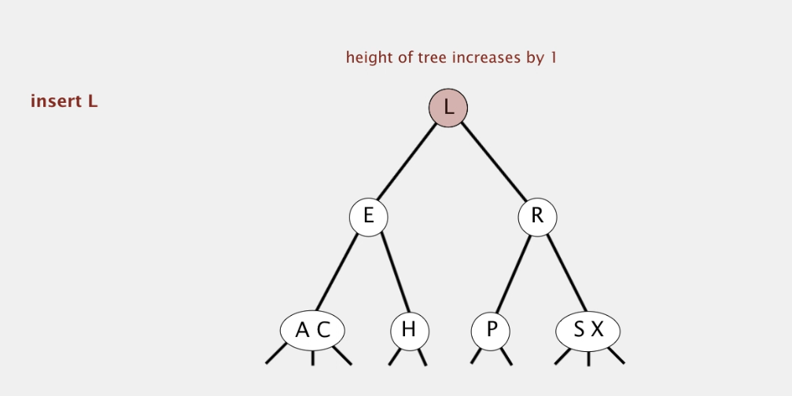
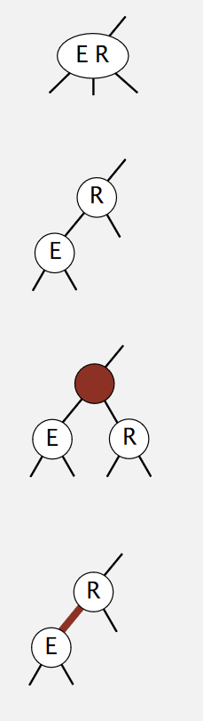
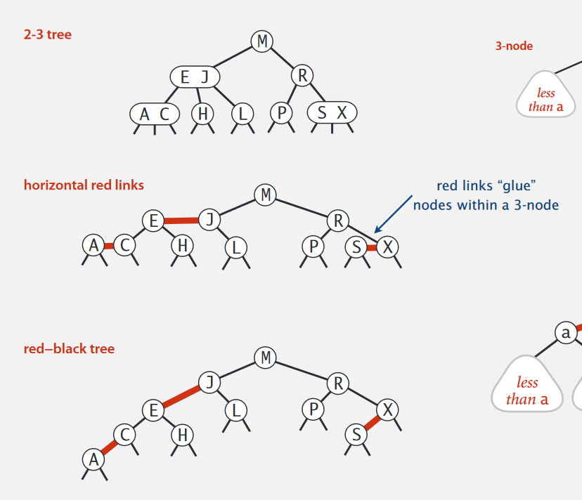

# **RedBlackTree : An Intuitive Appraoch**

# **Monologue**

I remember when the first time I studied **`Red Black Tree`** **(RBT)** it was all a very big puzzle . A seemily random _rotations_ and _colorings_ seems to somehow balance a **`Binary Search Tree`** **(BST)** . But I had no intuition for why these rotations and colorings seem to magically balance the BST .   

&nbsp;
I had no idea what the **`RED`** and **`BLACK`** node represents . I didn't even understand why they exist in the first place . After all , what has coloring got to do with the balancing of a Binary Search Tree , right ? . And why are they even called Red and Black in the first place , why not any other colors (_the answer is quite hilarious XD_) . All in all , it was **a giant black box** . All these Insert and Delete cases , nothing properly made sense . The number of unanswered questions stacked up and up . So , I embarked on a mission  to find answer to these and after scouring through the internet past few weeks and with a bit of imagination and sleepless nights , I think I finally got ahold of the answers to all the questions that my dumb brain was unable to grasp : ) . This writeup is to accumulate all these answers and make an intuitive approach to Red BLack Trees so that dumb people like me can also have a proper intuition for the underlying operations in Red Black Tree . You might never need to understand the underlying intuitions behind all the operations . You can just call **stl** **`map`** or **`set`** in `c++` and **`TreeMap`** in `java` , and can easily pass your life in peace . But if you do care for the intuition , _you are in for a ride_ : D

The whole writeup will be very long . So it is recommended that you finish this in multiple sitting : )

# **The Story Begins**

To properly understand anything you need to know its past . To me it's not optional , it's a must condition . In my search for proper understanding of Red Black Trees , this is when it started to make sense to me for the first time . 

I assume that you are familiar with Binary Search Trees and their shortcomings ( The complexity depends on tree height and in the worst case the height can be N , making all the operations **`O(N)`** )

So , we need to somehow make it balanced such that on average the height is **`logN`** . Red Black Tree with it magic rotations and colorings seems to somehow do this . But this is not the first data structure to do this . The key to understanding RBT lies on the first few varient of this data strucutre that attempted to solve this balance of BSTs .

## **A slightly modified BST**

Let's consider a slight variant of the RBT . Instead of 1 key per node as in the regular BST , we will store upto 2 keys per node in this case and each node can have upto 3 child .

That's it ! No other difference .

Now first consider **insertion** in this tree . How will we insert a node ?   
The idea is almost identical to regular BST . We compare the key wih the one in the tree and decide to go left , right or **middle** . Yes , the middle part is the only new thing here . This addition of new option is not hard to see why , since there can be 2 keys per node , the number of paths to take will be 3 of course !  
Now , what happens when  we find the position for insertion key . If adding this key doesn't change the property that we assumed (atmost 2 keys per node) , we can easily just add it ! 
- **When can we just add it without any concern ?**  
If we find that there is only 1 key , then we can just add another key and our tree properties will be perfectly fine !

    
    
    
&nbsp;

- **When does problem arise ?**  
The problematic case : we find the corresponding place for insertion and we insert it . If after insertion we see there are 3 keys , we are in troubble : ( As mentioned earlier , there can be atmost 2 keys per node . So , we need to somehow fix this unstable node . Otherwise we are doomed . Here is an example .

    

    
Now that we are stuck , it's not hard no find a way around in this tree . We see that `18` is sitting lonely out there and has a place for one extra friend . We push up the middle key of the unstable node and voila we are good again . There are no more 3 key node in this tree . 

    
Whoosh ! Nice save : D   

Now if you have good observation , you might have observed that all the leaf nodes have same distance from the root . This is not just a conincedence . Let's see why this is the case . 
 We have seen 2 different type of insertions so far and if you noticed , none of them changed the height of the tree . Now let's consider a case where the push up is such that there is an increase of height . 

 
 
 
 

 Did you see what just happened ? The height of the tree increased by 1 and the distance of all the leaf nodes increased exactly by 1 . Thus leading to having all the leaf nodes in the same height/depth .

 ## **Key Takeaway from slightly modified BST**
 We saw earlier that if there was a way to balance our BST , we can efficiently do operations . Our slightly modified BST does exactly that ! We just saw that our tree is always perfectly balanced !
 In this slightly modified BST , 
 - **Worst Case Height** : **`O(log_base2_N)`** / **`O(logN)`** (All nodes have 2 keys)
 - **Best Case Height** : **`O(log_base3_N)`** (All nodes have 3 keys)
  
## **Modifying one step further**
/// write aovut 2-3-4 trees  
This time we will allow upto 3 keys per node . One more than the last time . This time there is also one problematic case : when we  have 4 keys per node . We also do the same thing we did the last time . 

/// add spliting tree example - https://youtu.be/2679VQ26Fp4

&nbsp;

# **Changing Vantage Point**
Simulating this tree seems to be very easy in hand . But coding up this is not . Maintaing varaible number of keys in a node and also handling tree spliting can be a cumbersome job to do . If you are a lazy guy like me you wouldn't dare to implement this .

Now , let's change our vantage point . Let's cleverly represent this nodes so that we don't have to deal with all these tree spliting and variable nodes .

Here's how we can represnt the 2 key nodes :

Now , with a bit of imagination , we can think this of 2 seperate nodes glued together by a link . If we draw this link by leaning on the side a bit . You can see that it is just you familiar BST .

But wait ! How do you distinguish between an ordinary edge and a glue edge . Yes ! we color it : D . 

We can also instead color the nodes . By coloring the child of the red link red .
  
This is the ureka moment ! This is the RBT we have studied blindly all this time ! Finally we figured out the coloring ! RBT is nothing but a fancy way of representing the slightly modified BST we saw earlier . Isn't this great : D Finally we know what the color really means .

/// add this meme : this was RBT all this time ? always has been 

Now you ask , why is this red ? Why not any other colors ?

It was because the guys who invented this , only had red and black pens to draw . And they chose to color this link red  .

&nbsp;

# **Inside the Black Box**
Now that we finally have an idea of what RBT really is , let's dive deeper

