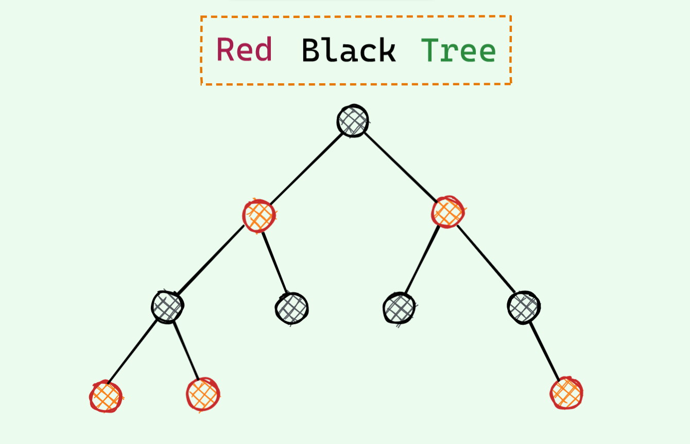
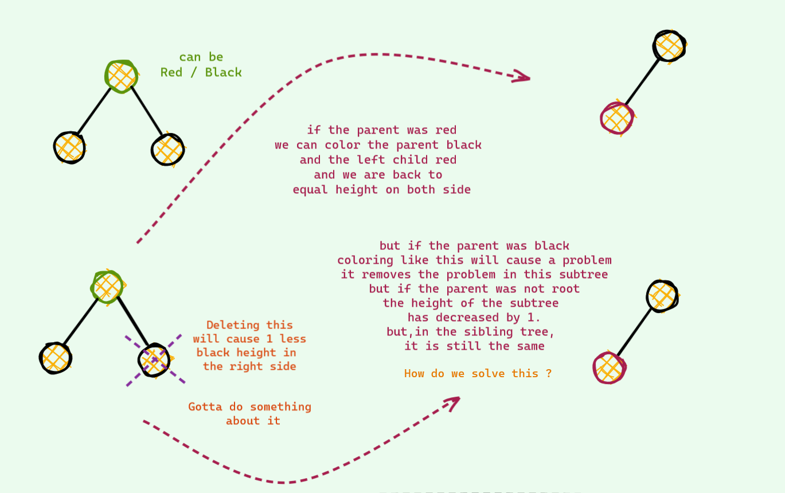

<h1 align="center">Red Black Tree : An Intuitive Approach</h1>
<hr/>

### **You can also read it from my [blog](https://zarif98sjs.github.io/mindcraft/RedBlackTree/)**

&nbsp;



<hr/>
<h1 align="center">Monologue</h1>
<hr/>


I remember when the first time I studied **`Red Black Tree`** **(RBT)** , it was an enigma . A seemingly random _rotations_ and _colorings_ seems to somehow balance a **`Binary Search Tree`** **(BST)** . But I had no intuition for why these rotations and colorings seem to magically balance the BST . I used to read these horrible case works and my reaction everytime after it got balanced was - Surprised Pikachu Face :

<p align="center">
  
</p>

&nbsp;
I had no idea what the **`RED`** and **`BLACK`** node represents . I didn't even understand why they exist in the first place . After all , what has coloring got to do with the balancing of a Binary Search Tree , right ? . And why are they even called Red and Black , why not any other colors (_the answer is hilarious XD_) . All in all , it was a giant **black box** . All these `Insert` and `Delete` cases , nothing properly made sense . The number of unanswered questions stacked up and up . So , I had to do something about it . After few weeks of _researching_ (read _**googling**_) , scouring through the internet and with a bit of imagination , I think I finally got ahold of the answers to all the questions that my dumb brain was unable to grasp : ) . This writeup is to accumulate all these answers and make an intuitive approach to Red BLack Trees so that dumb people like me can also have a proper intuition for the underlying operations in Red Black Tree and so that you don't have to do go through all of these by yourself again . 

&nbsp;
You might never need to understand the underlying intuitions behind all the operations . You can just call **stl** **`map`** or **`set`** in `c++` and **`TreeMap`** in `java` , and can easily pass your life in peace . But if you do care for the intuition , _you are in for a ride_ : D

<hr/>
<h1 align="center">The Story Begins</h1>
<hr/>

To properly understand anything you need to know its past . In my search for proper understanding of Red Black Trees , this is when it actually started to make sense to me for the first time . 

I assume that you are familiar with Binary Search Trees and their shortcomings ( The complexity depends on tree height and in the worst case the height can be N , making most of the operations **`O(N)`** )

So , we need to somehow make it balanced such that on average the height is **`logN`** . Red Black Tree with it magic `rotations` and `colorings` seems to somehow do this . But this is not the only data structure to do this . _The key to understanding RBT lies on the first few variant of this data structure that attempted to solve this balance of BSTs_.


<hr/>
<h1 align="center">A slightly modified BST</h1>
<hr/>


Let's consider a slight variant of the **BST**. Instead of **1 key** per node as in the regular BST , we will store upto **2 keys** per node in this case and each node can have **upto 3 child** .


That's it ! No other difference .

Now first consider **insertion** in this tree . How will we insert a node ?   
&nbsp;
The idea is almost identical to regular BST . We compare the key wih the one in the tree and decide to go left , right or **middle** . Yes , the middle part is the only new thing here . This addition of new option is not hard to see why , since there can be 2 keys per node , the number of paths to take will be 3 of course !  
&nbsp;
Now , what happens when  we find the position for insertion key . If adding this key doesn't change the property that we assumed (at most 2 keys per node) , we can just easily add it ! 
- **When can we just add it without any concern ?**  
If we find that there is only 1 key , then we can just add another key and our tree properties will be perfectly fine !

    
    
    
&nbsp;

- **When does problem arise ?**  
The problematic case : we find the corresponding place for insertion and we insert it . If after insertion we see there are 3 keys , we are in trouble : ( As mentioned earlier , there can be at most 2 keys per node . So , we need to somehow fix this unstable node . Otherwise we are doomed . Here is an example .

    

    
Now that we are stuck , it's not hard to find a way around in this tree . We see that `18` is sitting lonely out there and has a place for one extra friend . We push up the middle key of the unstable node and voila we are good again . There are no more 3 key node in this tree . 

    
Nice save : D   

Now if you have _good observation_ , you might have observed that _all the leaf nodes have same distance from the root_ . This is not just a coincidence . Let's see why this is the case .   
&nbsp;
 We have seen 2 different type of insertions so far and if you noticed , none of them changed the height of the tree . Now let's consider a case where the push up is such that there is an increase of height . 


 Did you see what just happened ? The height of the tree increased by 1 and the distance of all the leaf nodes increased exactly by 1 . Thus leading to having all the leaf nodes in the same height/depth .

 ### **Key Takeaway from slightly modified BST**
 We saw earlier that if there was a way to balance our BST , we can efficiently do operations . Our slightly modified BST does exactly that ! We just saw that our tree is always perfectly balanced !
 In this slightly modified BST , 
 - **Worst Case Height** : **`O(log_base2_N)`** / **`O(logN)`** (All nodes have 2 keys)
 - **Best Case Height** : **`O(log_base3_N)`** (All nodes have 3 keys)
  
## **Modifying one step further**

This time we will allow upto 3 keys per node . One more than the last time . This time there is also one problematic case : when we  have 4 keys per node . We also do almost the same thing we did the last time . When there is a potential 4 key node , we split to make room for the new key .

I will just show an example and won't dive deep .


&nbsp;

<hr/>
<h1 align="center">Changing Vantage Point</h1>
<hr/>

Simulating this tree seems to be very easy in hand . But coding up this is not . Maintaining variable number of keys in a node and also handling tree splitting can be a cumbersome job to do . If you are a lazy guy like me you wouldn't dare to implement this .

&nbsp;
Now , let's change our vantage point . Let's cleverly represent this nodes so that we don't have to deal with all these tree splitting and variable nodes .

&nbsp;
With a bit of imagination , we can think the 2 key nodes as 2 separate nodes glued together by an edge . If we draw this link by leaning on the side a bit , you can see that it is just your familiar BST .

&nbsp;
But wait ! How do you distinguish between an **ordinary edge** and a **glue edge** . Yes ! we color it : D 

Here's how we can represent the **`2 key nodes`** :


And here's how we can represent the **`3 key nodes`** :


We can also instead color children nodes thus making it convenient to implement as tracking edge colors in BST implementation would not be a headache anymore .

 

This was the eureka moment for me ! This is the **Red Black Tree** we have studied blindly all this time ! Finally we figured out the **coloring** ! RBT is nothing but a fancy way of representing the slightly modified BST we saw earlier . Isn't this great ? : D 


Now you ask , why is this red ? Why not any other colors ?
<details>
<summary>
Answer
</summary>

It was because the guys who invented this , only had red and black pens to draw :v And they chose to color the nodes red .
</details>

&nbsp;

<hr/>
<h1 align="center">Inside the Black Box</h1>
<hr/>

## **Insert**

Now , we know that the operations we saw till now was RBT under the hood . Let's see how these operations look in the RBT .


If you open a random book , you must have seen this weird rule which goes something like this : when there are 2 red nodes in a row and uncle is also a red node , we do color flip . Now you see what those color flip actually do ! These is just a fancy way to implement the splitting on the modified BST .

Now , let's see another type of insertion .


You might have also seen a rule which goes something like this : when there are 2 red nodes in a row and uncle is a black node , we need to rotate to balance the RBT . This is just a normal insertion in the modified BST ! This one has 2 case : the node could be red nodes could be in Left Right order unlike the Left left order shown in the last example . This is the same , just we do 2 rotations to come to our proper 3 key node representation .


## **Delete**

Insertion was pretty easy . Most of the books represent delete in RBT as an awful hard operation . Infact when I first read the deletion , it was just a bunch of messy casework to memorize and I had no idea what the heck we were actually doing . But now , it has changed . Deletion is not difficult than insertion in any way , if not easier !

&nbsp;
But , first let's recap some RBT properties which can be easily seen from our modified BST analogy :
- In modified BST , all leaf nodes were at the same height . So , in our RBT all the subtrees will have same black height (remember how red nodes doesn't contribute to the height , we just lean on either side to mimic BST)
- Root is always black 

This 2 properties are enough to understand Deletion .

Deletion process is almost similar to the normal BST . I won't dive deep . Here is a recap :
- If we have less than 2 child , we can delete this node
- Otherwise , we replace with the successor / predecessor node and delete that node instead
  
Now in case of RBT , there can be some violation . Let's see :
- If we are deleting a red node , we are safe (Remember that we can easily delete from 2 key node in our slightly modified BST as it doesn't affect the height of the tree)
- But if we are deleting a black node , we are in trouble : (  Deleting a black node will violate the first property we have seen earlier . We gotta fix this . This is the whole fiasco is about .

Let's begin . Rather than telling you a bunch of awful rules to memorize , let us see what can and can't be done intuitively . Let me walk you thorough -

**The Easy One**  

This time , the node we deleted has black sibling and no red children . Let see how it goes if we want to restore balance -



The idea to solve this is we hand our problem to the parent . And if the parent couldn't solve , then we repeat the same process . We know that it will be fixed some time in the future because we just saw in the case of parent being the root , our problem is solved immediately . 


**The Easier One**  
This time , the node we deleted has black sibling and at least one red children . Let's see how this one goes -


Pretty easy !

There is just one corner case , if the only red child was the right node in the example we just saw , we would have to do one more rotation (like we did in the insert) to make it like the one we solved .

**The Clever One**

We are almost done . We just need to take care of one last thing . The red sibling case - 


And now , we are done . See ! It was not that bad . Once we know why we are doing what , it immensely simplifies stuffs !

<hr/>
<h1 align="center">Getting our hands dirty (with code)</h1>
<hr/>

All these efforts till now were all for this . We had to come up with glue nodes and what not just so that we can easily implement this thing . So , let's get into it !

I remember when i first the RBT pseudocode from Cormen (CLRS) , I had a mini heart attack . My first reaction was , " Eww, how can a code be this ugly ! " And the impression hasn't changed a bit . It is still one of the most ugliest implementation I've seen till date . Coding a red black tree doesn't have to be this ugly .

Instead , I will guide you with a recursive implementation which I found much easier to code . Much much easier to debug and the size of the code will be half the size of the cormen implementation if not less . 

## **The Node**

We need just one more information from our usual BST : Color . No need to track parent or any other things . And about why we have taken a pointer array , not 2 left right pointers , I will get to that in a second .

```c++

#define left 0
#define right 1

struct Node
{
    int data,color;
    Node *child[2];

    Node(int data,int color)
    {
        this->data = data;
        this->color = color;
        this->child[left] = NULL;
        this->child[right] = NULL;
    }
};
```

## **Auxiliary Operations**

The main auxiliary operations are **`rotation`** and **`color flipping`** . The implementations are pretty much straightforward . If we had taken 2 separate pointers , the implementation would be like this 

```c++

#define RED 0
#define BLACK 1

bool red(Node *node)
{
    if(node==NULL)
        return false;

    return node->color == RED;
}

void colorFlip(Node *node)
{
    node->color = node->color^1;
    node->left->color = node->left->color^1;
    node->right->color = node->right->color^1;
}

Node* leftRotate(Node *node)
{
    Node *temp = node->right;
    node->right = temp->left;
    temp->left = node;

    temp->color = node->color;
    node->color = RED;

    return temp;
}

Node* rightRotate(Node *node)
{
    Node *temp = node->left;
    node->left = temp->right;
    temp->right = node;

    temp->color = node->color;
    node->color = RED;

    return temp;
}
```

But , if instead we had implemented using pointer array , we can actually write only one function for the rotation ! 

```c++
Node* rotate(Node *node,bool dir) /// direction : left / right
{
    Node *temp = node->child[!dir];
    node->child[!dir] = temp->child[dir];
    temp->child[dir] = node;

    temp->color = node->color;
    node->color = RED;

    return temp;
}
```

And this way , our double rotation code is just 2 lines !

```c++
Node* doubleRotate(Node *node,bool dir) /// align reds  , then rotate
{
    node->child[!dir] = rotate(node->child[!dir],!dir);
    return rotate(node,dir);
}
```

We have already made our code half the size ! You will be amazed to see the magic of this further when we don't have to separately handle the mirror cases in insert and delete operation : D At least I was , when I found out this trick when scouring through the internet which dramatically reduced my original insert implementation .

Let's get into insertion .

## **Insert**

```c++
void insert(int data)
{
    root = __insert(root,data);
    root->color = BLACK;
}

Node* __insert(Node *node,int data)
{
    if(node == NULL)
        return new Node(data,RED);

    bool dir = data > node->data; /// left -> 0 , right -> 1

    node->child[dir] = __insert(node->child[dir],data);

    return INSERT_FIX_UP(node,dir);
}
```

We just need to write this magic function **`INSERT_FIX_UP`** and we are done ! Iterative implementations needs to track parent and also handing all the cases can be really pain . But , we will take advantage of the bottom up approach . If a RBT property violation has occurred , we will fix on our way up in the recursion !

```c++
Node* INSERT_FIX_UP(Node *node,bool dir)
{
    if(red(node->child[dir]))
    {
        /// case 1 : both child red => any one child has 2 reds in a row (LL LR RR RL) => flip colors
        if(red(node->child[!dir]))
        {
            if(red(node->child[dir]->child[dir]) || red(node->child[dir]->child[!dir]))
            {
                colorFlip(node);
            }
        }
        else
        {
            /// case 2 : both child not red
            if(red(node->child[dir]->child[dir]))
            {
                /// any one child has 2 reds in a row (LL RR) => rotate
                node = rotate(node,!dir);
            }
            else if(red(node->child[dir]->child[!dir]))
            {
                /// any one child has 2 reds in a row (LR RL) => align first , then rotate
                node = doubleRotate(node,!dir);
            }
        }
    }
    return node;
}
```

See , how we don't need to write code for additional **mirror cases** !

## **Delete**

The delete skeleton is the same as regular BST , with just one minor change . We keep a **`flag`** variable to keep track if we have already restored the balance or not . 

```c++
void delete_(int data)
{
    bool ok = false;
    root = __delete(root,data,ok);
    if(root!=NULL) root->color = BLACK;
}

Node* __delete(Node *node,int data,bool &ok)
{
    if(node == NULL)
    {
        ok = true;
        return;
    }

    /// found the delete key
    if(node->data == data)
    {
        /// has one or less child
        if(node->child[left]==NULL || node->child[right]==NULL)
        {
            Node* temp = NULL;
            if(node->child[left]) temp = node->child[left];
            if(node->child[right]) temp = node->child[right];

            if(red(node)) /// the node is red => just delete it
            {
                free(node);
                ok = true;
            }
            else if(red(temp)) /// only child is red => replace with that red child and recolor black . so , black balance restored
            {
                temp->color = BLACK;
                free(node);
                ok = true;
            }

            return temp;
        }
        else /// has 2 child => replace with inorder predecessor / successor and recurse for that
        {
            Node *temp = getMax(node->child[left]); /// inorder predecessor : maximum value in the left subtree

            node->data = temp->data;
            data = temp->data; /// updating with predecessor data as this is the one to delete now
        }
    }


    bool dir = data > node->data;

    node->child[dir] = __delete(node->child[dir],data,ok); /// recurse
    
    return ok ? node : DELETE_FIX_UP(node,dir,ok);
}
```

Now , we have to write the magic function **`DELETE_FIX_UP`** .

```c++
Node* DELETE_FIX_UP(Node *node,bool dir, bool &ok)
{
    Node *parent = node; /// saving for later red sibling fixing case
    Node *sibling = node->child[!dir];

    /// Red Sibling Case => Reduce to Black Sibling Case
    if(red(sibling))
    {
        node = rotate(node,dir);
        sibling = parent->child[!dir];
    }

    if(sibling != NULL)
    {
        /// Black Sibling Case , Part 1 : Black Sibling with only black children
        if(!red(sibling->child[left]) && !red(sibling->child[right]))
        {
            if(red(parent)) ok = true; /// will color it black and sibling subtree will not have imbalance

            parent->color = BLACK; /// if not ok , we proceed further
            sibling->color = RED;
        }
        else /// Black Sibling Case , Part 2 : Black Sibling with not red children
        {

            int initcol_parent = parent->color;
            bool isRedSiblingReduction = !(node==parent);

            if(red(sibling->child[!dir])) /// RR , LL
            {
                parent = rotate(parent,dir); /// single rotation
            }
            else
            {
                parent = doubleRotate(parent,dir); /// align and rotate
            }

            parent->color = initcol_parent; /// color will be the same as initial parent
            parent->child[left]->color = BLACK;
            parent->child[right]->color = BLACK;

            if(isRedSiblingReduction)
            {
                node->child[dir] = parent; /// fixing the child for proper bottom up fixing later
            }
            else
            {
                node = parent; /// usual black case
            }

            ok = true;
        }
    }

    return node;
}

```

Ah , we are done finally ! It was not that awful , was it ?

<hr/>
<h1 align="center">Optimization and Conclusion</h1>
<hr/>

If you have come this far down, let me tell you one more thing. The RBT we studied is the classical old RBT. There are other implementations of RBT which makes the code even more shorter and easier to write. Among these, one is **`Left Leaning Red Black Tree`** **(LLRB)**. It is nothing but the implementation of the _first modified BST_ we saw. And about the implementation, we can also use a **`topdown approach`**, that is also easier to understand than the bottom-up approach. If you do feel interested, check them out.

Congrats on reading this far : D If you still need help, do let me know. ***And if you liked the write-up, you can support me by buying me a cup of coffee!***
<p align="center">
<a href="https://www.buymeacoffee.com/zarif98sjs" target="_blank"></a>
</p>


<hr/>
<h1 align="center">Reference</h1>
<hr/>

Ah! lot of them , I'm going to mention as many as I can remember.
- [https://en.wikipedia.org/wiki/Red%E2%80%93black_tree?oldformat=true](https://en.wikipedia.org/wiki/Red%E2%80%93black_tree?oldformat=true)
- [https://www.cs.purdue.edu/homes/ayg/CS251/slides/chap13c.pdf](https://www.cs.purdue.edu/homes/ayg/CS251/slides/chap13c.pdf)
- [http://smile.ee.ncku.edu.tw/old/Links/MTable/Course/DataStructure/2-3,2-3-4&red-blackTree_952.pdf](http://smile.ee.ncku.edu.tw/old/Links/MTable/Course/DataStructure/2-3,2-3-4&red-blackTree_952.pdf)
- [https://stackoverflow.com/questions/15455042/can-anyone-explain-the-deletion-of-left-lean-red-black-tree-clearly](https://stackoverflow.com/questions/15455042/can-anyone-explain-the-deletion-of-left-lean-red-black-tree-clearly)
- [https://www.cs.princeton.edu/~rs/talks/LLRB/LLRB.pdf](https://www.cs.princeton.edu/~rs/talks/LLRB/LLRB.pdf)
- [https://stackoverflow.com/questions/364616/in-red-black-trees-is-top-down-deletion-faster-and-more-space-efficient-than-bot/8024168#8024168](https://stackoverflow.com/questions/364616/in-red-black-trees-is-top-down-deletion-faster-and-more-space-efficient-than-bot/8024168#8024168)
- [https://www.youtube.com/watch?v=DQdMYevEyE4](https://www.youtube.com/watch?v=DQdMYevEyE4)
- [https://eternallyconfuzzled.com/red-black-trees-c-the-most-common-balanced-binary-search-tree](https://eternallyconfuzzled.com/red-black-trees-c-the-most-common-balanced-binary-search-tree)
- [https://stackoverflow.com/questions/14119995/red-black-tree-top-down-deletion-algorithm?rq=1](https://stackoverflow.com/questions/14119995/red-black-tree-top-down-deletion-algorithm?rq=1)
- [https://stackoverflow.com/questions/13360369/deletion-in-left-leaning-red-black-trees](https://stackoverflow.com/questions/13360369/deletion-in-left-leaning-red-black-trees)
- [ftp://ftp.cs.princeton.edu/techreports/1985/006.pdf](ftp://ftp.cs.princeton.edu/techreports/1985/006.pdf)
- [https://sites.cs.ucsb.edu/~teo/cs130a.m15/rbd.pdf](https://sites.cs.ucsb.edu/~teo/cs130a.m15/rbd.pdf)
- [https://stackoverflow.com/questions/14119995/red-black-tree-top-down-deletion-algorithm](https://stackoverflow.com/questions/14119995/red-black-tree-top-down-deletion-algorithm)
- [https://iq.opengenus.org/red-black-tree-deletion/](https://iq.opengenus.org/red-black-tree-deletion/)
- [https://github.com/jeffrey-xiao/competitive-programming/blob/master/src/codebook/datastructures/RedBlackTree.java](https://github.com/jeffrey-xiao/competitive-programming/blob/master/src/codebook/datastructures/RedBlackTree.java)
- [https://www.topcoder.com/community/competitive-programming/tutorials/an-introduction-to-binary-search-and-red-black-trees/](https://www.topcoder.com/community/competitive-programming/tutorials/an-introduction-to-binary-search-and-red-black-trees/)
- [https://softwareengineering.stackexchange.com/questions/141834/how-is-a-java-reference-different-from-a-c-pointer](https://softwareengineering.stackexchange.com/questions/141834/how-is-a-java-reference-different-from-a-c-pointer)
- [https://www.programiz.com/dsa/red-black-tree](https://www.programiz.com/dsa/red-black-tree)
- [https://www.cs.usfca.edu/~galles/visualization/RedBlack.html](https://www.cs.usfca.edu/~galles/visualization/RedBlack.html)
- [https://www.cs.princeton.edu/courses/archive/fall06/cos226/lectures/balanced.pdf](https://www.cs.princeton.edu/courses/archive/fall06/cos226/lectures/balanced.pdf)
- [https://www.cs.princeton.edu/courses/archive/spring19/cos226/lectures/33BalancedSearchTrees.pdf](https://www.cs.princeton.edu/courses/archive/spring19/cos226/lectures/33BalancedSearchTrees.pdf)


